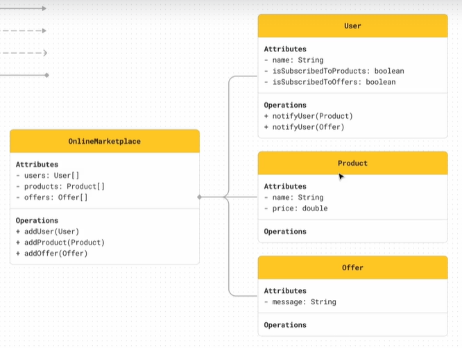
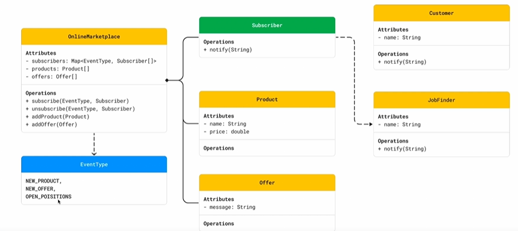

## Observer Applicability - When to Use

 اما يكون عندك أي تغيير هيحصل على الـ State بتاعة جزء في الـ System وليكن Object معين , أو بمعنى تاني اما يكون عندك Event أو Action هيحصل في الـ System والتغيير اللي هيحصل ده هيتطلب تغييرات أو حاجة معينة تتم من خلال Objects تانيين وسواء كان الـ Objects التانيين دول معروفين ليك او لا فالـ Observer هيساعدك تحقق ده بشكل Dynamically

 

 لو عندك في الـ System بعض الأجزاء اللي مهتمة بحدوث تغييرات هتحصل على جزء معين , وسواء كان ده هيتم بشكل مؤقت أو دائم فبرضو الـ Observer هيساعدك تحقق ده لانه مناسب جدًا للـ Subscription Base Model وزي ما شوفنا الـ Subscribers ممكن ينضافوا او يتعملهم Cancel Subscription بشكل Dynamic فده هيساعدك جدا.

-------------

## Without Observer

## With Observer

